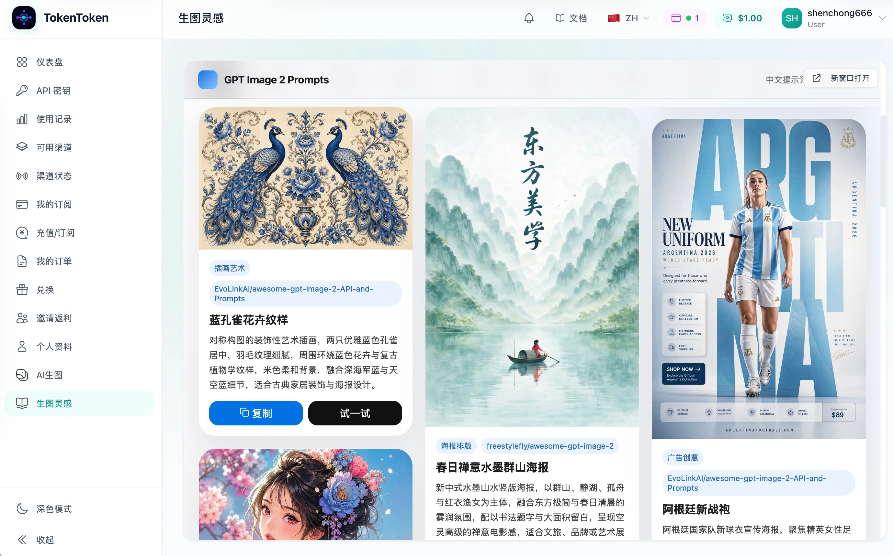
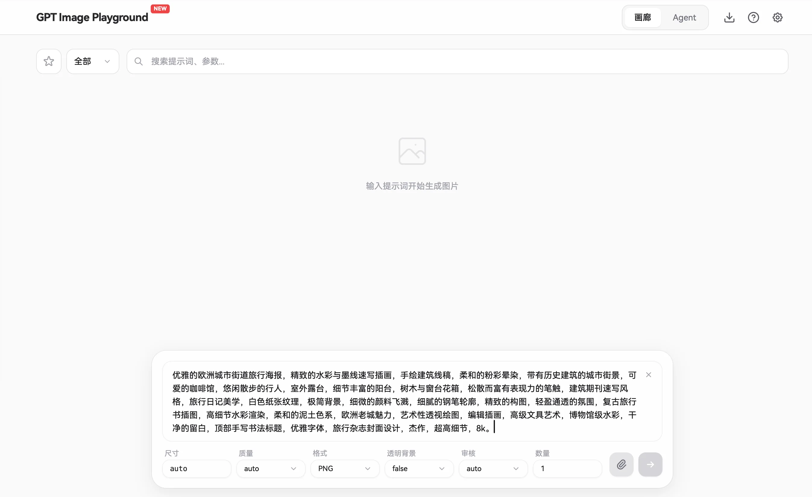
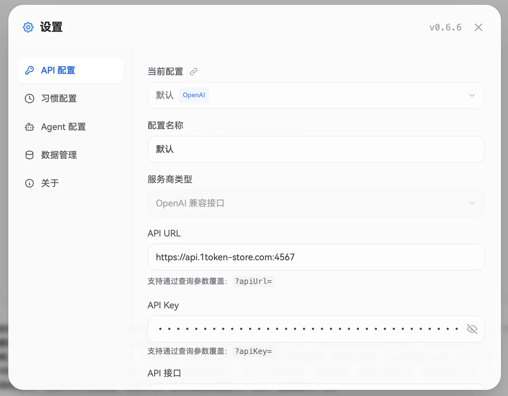
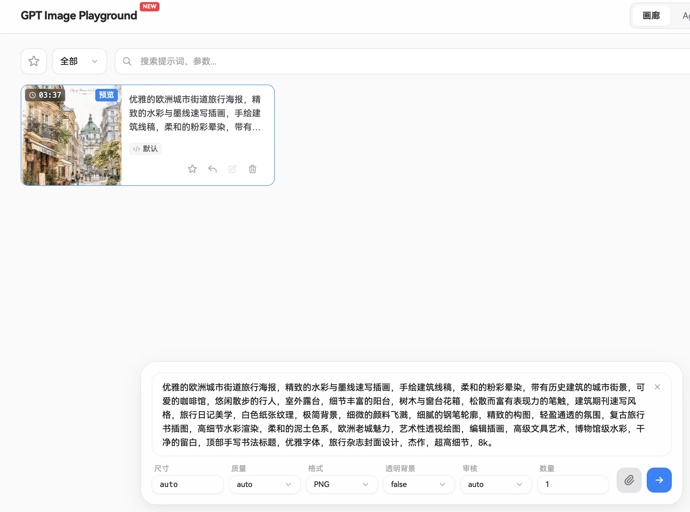

# AI生图

## 什么是gpt\-image\-2 ？

GPT\-image\-2 可以理解成一个“会听话的图片助理”：你用普通话描述需求，它就能帮你生成海报、配图、教学插画、封面图，甚至修改现有图片。

它最适合解决日常工作里的“我需要一张图，但不想从零设计”的问题：职场人可以做汇报配图和活动海报，剪辑师可以做视频封面、分镜参考和背景素材，老师可以做课件插图、知识图解和课堂视觉材料。

它的价值不是替代设计师，而是让不会画图、不会设计的人，也能快速把想法变成可用的视觉素材。只要你能说清楚“给谁看、用在哪、想表达什么”，它就能帮你更快完成工作。

## 准备工作

1. 大模型生图需要消耗Token，首先在官网[TokenToken](https://1token-store.com) 申请API密钥

2. 操作步骤参考网站使用文档：[TokenToken使用文档](https://givklov4fjz.feishu.cn/docx/YypYdoSCno9bdwxLAuocINyrnlf)

## 如何使用

1. 注册账号并登录后，可在左边菜单栏找到“生图灵感”选项，点击进入后可查看各种生图提示词以及图片样例。如果图片展示格式有遮挡或闪烁等问题，可点击右上角的新窗口打开，单独开个页面查看。

2. 找到合适的样例后点击“复制”按钮，即可复制完整提示词，然后点击“试一试”按钮跳转到生图工具。在对话框输入生图提示词。

3. 然后点击右上角的设置按钮，把在[API密钥界面](https://1token-store.com/keys)申请到的密钥填入。

4. 在聊天窗口点击发送按钮，耐心等待即可得到你的作品。

