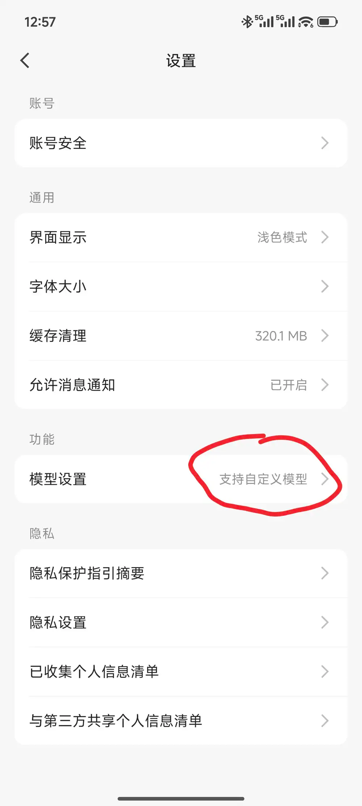
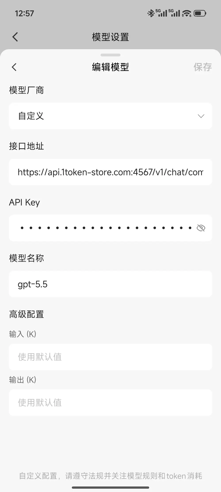
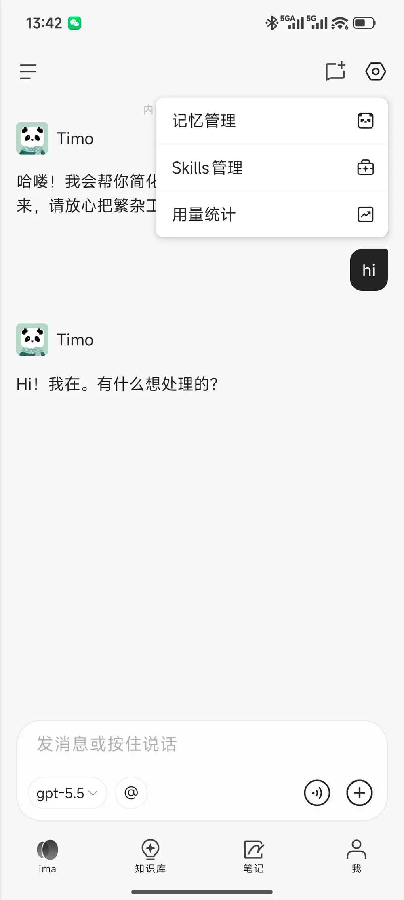

# IMA\+GPT=精品小龙虾

## ima是什么？

ima是腾讯开发的AI工作台，以知识库为核心，支持读搜写。copilot是其专属知识伙伴，擅长处理复杂任务，可自定义模型、安装Skill，能越用越懂用户，可以把它当成一只养在云端的小龙虾，配好模型开箱即用，配置在手机上跟电脑端的[Codex使用教程](https://givklov4fjz.feishu.cn/docx/D8IadBFpIoEzfXxOEgecSOeAnVe)互补。

## 如何接入？

1. 应用商店搜索ima，熊猫的图标就是ima，腾讯官方出品app。

2. 微信登陆ima后进入我的页面，进入设置菜单。

3. 然后在“功能”模块点击“模型设置”，进入模型设置页面，点击“添加自定义模型”，参数分别填

    1. 接口地址，https://api\.1token\-store\.com:4567/v1/chat/completions

    2. API Key，按照这个文档 [TokenToken使用文档](https://givklov4fjz.feishu.cn/docx/YypYdoSCno9bdwxLAuocINyrnlf) 注册申请

    3. 模型名称，gpt\-5\.5

4. 填好参数点击右上角保存，如果保存失败，建议去官网 [TokenToken](https://1token-store.com/) 核实下账户或订阅是否有额度。保存成功后，点击左侧的图标 “三”，找到copilot，即可开始聊天了。右上角的设置里可以查看copilot的记忆和Skills，越用越丰富。

